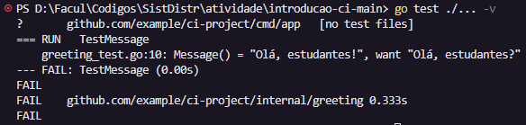

1. Explique como a pipeline é disparada no GitHub Actions. Na sua resposta, cite especificamente o que você configurou no arquivo ci.yml.

Resposta: A pipeline dispara quando ocorre um `push` na branch `main`, devido ao evento `on: push` configurado no workflow.

2. O que é um runner no GitHub Actions e qual o seu papel na execução da pipeline?

Resposta: Runner e a maquina que executa os processos do workflow. No arquivo, tem `runs-on: ubuntu-latest` para definir o ambiente de execucao.

3. Qual a diferença entre buildar a aplicacao inteira como binario e buildar a imagem Docker?

Resposta: O build do binario gera um executavel para um sistema especifico. O build da imagem Docker empacota aplicacao + runtime + dependencias em uma imagem que roda em qualquer lugar com Docker, dadas as informações do Dockerfile.

4. Por que usar Docker em uma pipeline CI pode ser util?

Resposta: Isso garante um ambiente consistente e reprodutivel, e ja gera o artefato de deploy em container. 

5. Altere temporariamente o codigo para fazer um teste falhar.

- O que aconteceu com o pipeline?

Resposta: A pipeline falhou porque um teste falhou.

- Em qual etapa ele falhou?

Resposta: Na etapa de testes (`go test ./...`).

- Anexe um print do erro.

